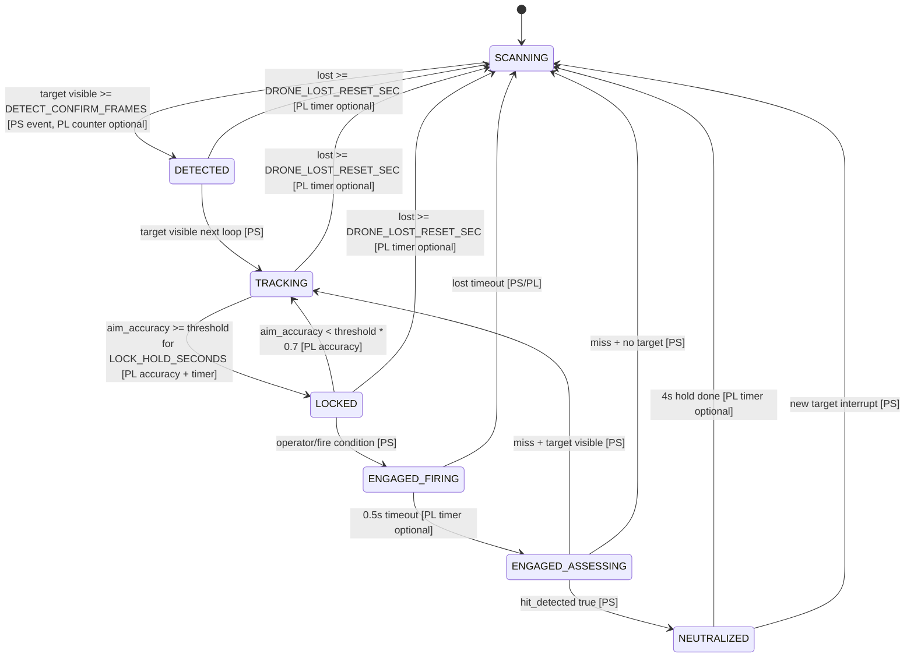
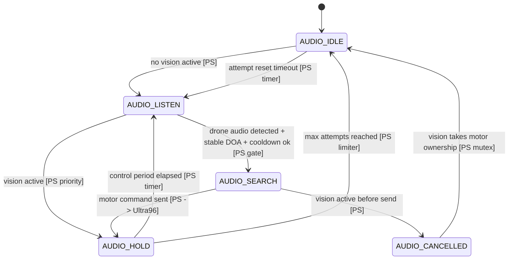

# PL 기반 FSM 재설계 및 오디오 탐색 적용 계획

## 현재 적용된 우선 구현

오늘 우선 구현한 범위는 "카메라에 드론이 없을 때만 ReSpeaker/오디오 모델 방향으로 팬을 돌리는 것"이다.

- 오디오 탐색 제한기 추가: `jetson/jetson_node.py:322`
- 비전 활성 상태 정의: `jetson/jetson_node.py:376`
- 오디오 명령 허용/차단 분기: `jetson/jetson_node.py:788`
- 같은 방향 쿨다운 및 최대 시도 제한: `jetson/jetson_node.py:868`
- 모터 명령 mutex: `jetson/src/control/ultra_yubin_motor.py:54`
- 설정값: `jetson/src/config.py:208`

오디오 팬 명령은 비전 FSM이 `DETECTED`, `TRACKING`, `LOCKED`, `ENGAGED*`일 때 차단한다. 즉 비전이 우선이고, 오디오는 `SCANNING` 또는 `NEUTRALIZED`에서만 탐색 보조로 동작한다.

## 메인 비전 FSM 재설계

권장 상태:

- `SCANNING`: 비전 타겟 없음, 오디오 탐색 허용
- `DETECTED`: 타겟 확인 중
- `TRACKING`: 타겟 추적 중
- `LOCKED`: 조준 안정
- `ENGAGED_FIRING`: 레이저/타격 시도 0.5초
- `ENGAGED_ASSESSING`: 타격 결과 확인 1.0초
- `NEUTRALIZED`: 4초 표시 hold, 새 타겟 감지 시 즉시 인터럽트

전이 기준:

- `SCANNING -> DETECTED`: `DETECT_CONFIRM_FRAMES` 연속 감지
- `DETECTED -> TRACKING`: 감지가 계속되면 다음 루프에서 전이
- `TRACKING -> LOCKED`: `aim_accuracy >= LOCK_AIM_THRESHOLD`가 `LOCK_HOLD_SECONDS` 동안 유지
- `LOCKED -> TRACKING`: 정확도가 `LOCK_AIM_THRESHOLD * 0.7` 미만으로 하락
- lost 기준: 마지막 감지 시각 `drone_lost_since`부터 `DRONE_LOST_RESET_SEC`
- `ENGAGED_FIRING -> ENGAGED_ASSESSING`: 0.5초 타임아웃
- `ENGAGED_ASSESSING -> NEUTRALIZED`: hit 확인
- `ENGAGED_ASSESSING -> TRACKING`: hit 실패지만 타겟 계속 보임
- `ENGAGED_ASSESSING -> SCANNING`: 타겟 없음



## 오디오 FSM

오디오는 독립 추적기가 아니라 비전이 비었을 때의 팬 방향 탐색 보조다.

정책:

- 비전 우선: `DETECTED/TRACKING/LOCKED/ENGAGED*`에서는 오디오 모터 명령 금지
- 오디오 탐색 허용: `SCANNING/NEUTRALIZED`
- 같은 ±15도 방향은 5초 안에 재시도 금지
- 최대 3회 탐색 후 10초 동안 추가 탐색 금지
- 비전 타겟이 잡히면 오디오 탐색 제한기는 reset
- 모터 명령은 mutex로 직렬화



## PL 활용 후보 평가

### 후보 A: FSM 전체를 PL

발표 효과는 크지만 지금 단계에서는 비추천이다. 상태 조건이 아직 자주 바뀌고, ENGAGED/NEUTRALIZED 정책도 실험하면서 바뀔 가능성이 높다. RTL 수정과 bitstream 재빌드가 매번 필요해서 시연 직전 리스크가 크다.

### 후보 B: 추적 제어 + aim_accuracy 계산

가장 현실적이다. 현재 PL은 이미 픽셀 오차를 받아 pan/tilt goal 계산을 수행한다. 여기에 `aim_accuracy`만 추가하면 "추적 제어와 조준 정확도 계산을 PL에서 수행한다"는 설명이 가능하다.

### 후보 C: 타이머/카운터 IP

후보 B와 조합하면 좋다. `lock_duration`, `lost_duration`, `neutralized_hold` 같은 시간 기준은 PL 카운터로 만들 수 있고, PS는 상태 전이만 결정한다.

### 후보 D: 모터 명령 중재

최종적으로는 발표 임팩트가 크다. 다만 지금은 Jetson main loop와 mutex로 먼저 해결하고, PL 중재는 2단계로 넣는 게 안전하다.

## 최종 권장 구조

현실적인 순서는 `B + C`, 이후 여유가 있으면 `D`다.

역할 분담:

- Jetson: YOLO, 오디오 모델, bbox/DOA 이벤트 생성
- PS: UDP 수신, 상태 전이, U2D2 패킷 송신
- PL: 픽셀 오차 기반 pan/tilt goal 계산, aim_accuracy 계산, 상태 타이머/카운터

데이터 흐름:

```text
Jetson bbox/audio event
  -> Ultra96 PS UDP bridge
  -> PL register write: cx, cy, frame, valid, mode
  -> PL computes pan_goal, tilt_goal, aim_accuracy, timers
  -> PS reads PL result
  -> PS sends Dynamixel command through U2D2
```

수정 지점:

- Jetson 오디오 게이트: `jetson/jetson_node.py:788`
- Jetson 모터 mutex: `jetson/src/control/ultra_yubin_motor.py:54`
- PS bridge PL register protocol: `hardware/pl_goal_compute/ps_app/pl_udp_usb_dxl_bridge.c`
- RTL goal/accuracy/timer 추가: `hardware/pl_goal_compute/rtl/pl_goal_compute_axi.v`
- 테스트벤치 갱신: `hardware/pl_goal_compute/tb/pl_goal_compute_axi_tb.v`

비트스트림 재빌드가 필요한 범위:

- 후보 B/C/D를 PL에 넣으면 RTL, testbench, Vivado bitstream 재빌드 필요
- 오늘 적용한 오디오 FSM 게이트와 mutex는 Jetson Python 수정이라 bitstream 재빌드 불필요

## 발표 방어 논리

Ultra96 PL을 쓰는 이유:

- PL은 픽셀 오차에서 모터 목표값을 일정한 지연으로 계산한다.
- PL 카운터를 쓰면 lock/lost/hold 시간 판정의 jitter를 줄일 수 있다.
- PS는 네트워크와 U2D2 송신을 맡고, PL은 반복 계산/카운터를 맡아 역할이 분리된다.
- 추후 PL arbitration을 넣으면 비전/오디오 명령 충돌을 하드웨어 우선순위로 막을 수 있다.

측정 지표:

- Jetson loop FPS
- Jetson -> Ultra96 UDP RTT
- PS bridge command RTT
- PL compute count 증가 주기
- target center error 평균/표준편차
- lock 진입까지 걸린 시간
- lost 이후 SCANNING 복귀 시간 jitter

## 구현 우선순위

D-2 이상:

- 오디오 탐색 gate 실험
- ReSpeaker/Junmo 모델 threshold 조정
- `audio_fallback`, `audio_hold`, `audio_cancel_vision` 로그 확인

D-1:

- PL aim_accuracy 추가 여부 결정
- RTL 변경 시 bitstream 백업 후 1회만 반영
- 기존 `run_demo_ps_safe.sh` 롤백 경로 유지

D-day:

- RTL 대수술 금지
- Python env 튜닝만 허용
- 시연은 `run_demo_ps_fast2_audio.sh` 또는 안정판으로 고정
